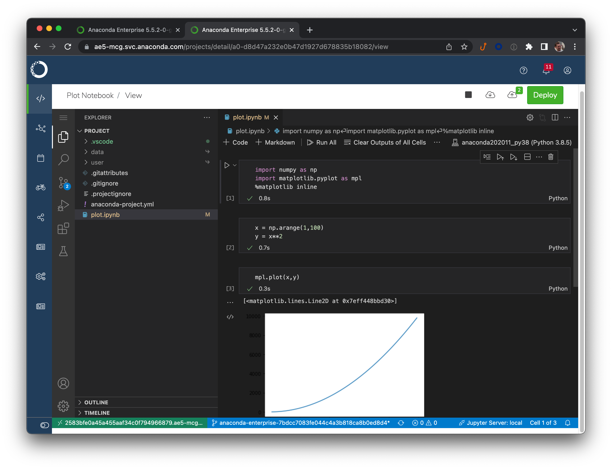

# Adding VSCode support to AE5

## Introduction

> **NOTE**: there is an as-yet-unsolved issue that causes a
> UI issue with VSCode when running inside the AE5 iframe.
> Specifically, the "new file" and "new 
> [operating-system issue](https://bugzilla.redhat.com/show_bug.cgi?id=1909037) 
> that prevents some R environments from working with RStudio.
> This has been corrected in AE5.5.2. For AE5.5.1, there is a
> simple workaround: add the conda package `openldap=2.4` to
> the environment in question (and, if appropriate, your 
> `anaconda-project.yml` specification) *before* switching
> to the RStudio editor.

This repository allows AE5 customers to install VSCode and use it
within AE5. Technically, the stock Microsoft version of VSCode does
not run in a browser-based environment such as this, so instead we
rely upon [`code-server`](https://coder.com/docs/code-server/latest),
a patched version of VSCode that enables in-browser execution but
otherwise preserves VSCode behavior, including the use of extensions.

These instructions are intended to be followed by the customer
and can be applied to AE 5.5.1 or later. Installation introduces
minimal disruption to the cluster, and can easily be reverted if
issues arise. The Anaconda team is happy to assist if necessary.

Auxiliary tools such as RStudio, VSCode, or Zeppelin are installed
into a shared volume provisioned just for this purpose. If RStudio
is the first tool being installed, those instructions will need
to be followed first. See the document [TOOLS.md](TOOLS.md) for
more details, and make sure that work is completed before
proceeding with the instructions here.

The latest approved versions of the RStudio support files can
always be found at these links.

- This file, in PDF form: [vscode-install.pdf](http://airgap.svc.anaconda.com.s3.amazonaws.com/misc/vscode-install.pdf)
- Tools volume documentation: [tools-volume.pdf](http://airgap.svc.anaconda.com.s3.amazonaws.com/misc/tools-volume.pdf)
- Installer project: [vscode-installer.tar.bz2](http://airgap.svc.anaconda.com.s3.amazonaws.com/misc/vscode-installer.tar.bz2)

## Installation

We have broken up the installation process into the steps below:

1. _Set the tool volume to read-write._ **(5.5.1 only)**
2. _Launch the RStudio installation project._
3. _Perform the basic installation._
4. _Enable the VSCode editor option._
5. _Verify the installation._
6. _Further customize VSCode._
7. _Set the tool volume to read-only._ **(5.5.1 only)**

The steps will have the following impact on the behavior of the cluster:

- No *existing* sessions or deployments will be affected. Users
  can continue to work in existing sessions without interruption.
- During Steps 1, 4, and 7, there will be brief (<30 second)
  interruptions in the function of main UI.
- While Steps 2 through 6 are in progress, the `/tools` volume
  will be mounted into any new sessions, deployments, and jobs
  in a read-write fashion.
  
Overall, we recommend executing these steps during a maintenance
interval, during which users should not create new sessions. But
you do not need to ask your users to halt existing sessions
or deployments.

***NOTE:*** if you are performing this work on AE 5.5.2 or later,
the steps have been simplified. Look for annotations marked
*"5.5.1"* or *"5.5.2+"* for steps that are specific to each version.

### Step 1. Set the tool volume to read-write (5.5.1)

***5.5.2+:*** skip this step and proceed directly to step 2.

1. Edit the `anaconda-platform.yml` ConfigMap. On Gravity clusters,
   this is most easily performed in the Ops Center.
2. Search for the `/tools:` volume specification.
3. Change `readOnly: true` to `readOnly: false`.
4. Save the changed configuration, and exit the editor.
5. Restart the workspace pod:
   ```
   kubectl get pods | grep ap-workspace | cut -d ' ' -f 1 | xargs kubectl delete pod
   ```
6. Monitor the new workspace pod using `kubectl get pods` and
   wait for it to stabilize.

### Step 2. Launch the VSCode installer project
 
As mentioned above, installation will proceed from within a standard
AE5 session. So to begin the process, we complete the following steps:

1. ***5.5.2+:*** log into AE5 as the 
   storage manager user, typically `anaconda-enterprise`.
   This is the user that is given read-write access to the
   `/tools` volume.
2. Download the installer project and save it to the machine
   from which you are accessing AE5. A link is provided
   in the top section of this document.
3. In a new browser window, log into AE5, and use the
   "Create+ / Upload Project" dialog to upload the VSCode
   Installation project archive that has been provided to you.
4. We recommend using the JupyterLab editor for this project. To
   change this, click on the project's name to be taken to the settings
   page, change the Default Editor, and Save.
5. Launch a session for this project.
   
### Step 3. Perform the basic installation

The VSCode installer project contains the basic set of files needed
to install the latest tested version of `code-server`, as well as the
Microsoft Python and Jupyter Notebook extensions.

1. Launch a terminal window, or return to an existing one.
2. If you have previously installed content into `/tools/vscode`,
   remove it now. The script will not proceed if there is any
   content in that directory. For simplicity, you can remove
   the entire directory; e.g., `rm -r /tools/vscode `.
3. Run the command `bash install_vscode.sh`. Before performing
   any modifications, the script verifies that all of its
   prerequisites are met.
4. Perform a basic verification of installation by running the script
   `/tools/vscode/start_vscode.sh`.
   _This should exit with an error_, specifically an “address already
   in use” error of some sort. The key is to verify that this error
   actually came from RStudio itself, which confirms that the
   application is visible to Anaconda Enterprise.

The output of the installer script should look like this:

```
+----------------------+
| AE5 VSCode Installer |
+----------------------+
| Install prefix: /tools/vscode
| Staging prefix: /tools/vscode
- Installing code-server
> tar xfz downloads/code-server-4.0.1-linux-amd64.tar.gz --strip-components 1 -C /tools/vscode
- Installing extensions
> /tools/vscode/bin/code-server --extensions-dir=/tools/vscode/extensions --install-extension=downloads/ae5-session-0.3.1.vsix
| Installing extensions...
| Extension 'ae5-session-0.3.1.vsix' was successfully installed.
> /tools/vscode/bin/code-server --extensions-dir=/tools/vscode/extensions --install-extension=downloads/ms-python.python-2021.12.1559732655.vsix
| Installing extensions...
| Extension 'ms-python.python-2021.12.1559732655.vsix' was successfully installed.
> /tools/vscode/bin/code-server --extensions-dir=/tools/vscode/extensions --install-extension=downloads/ms-toolsai.jupyter-2022.1.1001615337.vsix
| Installing extensions...
Unable to install extension 'ms-toolsai.jupyter' as it is not compatible with VS Code '1.63.0'.
Failed Installing Extensions: file:///opt/continuum/project/downloads/ms-toolsai.jupyter-2022.1.1001615337.vsix
- Run the Python extension patcher
> /opt/continuum/anaconda/bin/python patch_python_extension.py /tools/vscode
| AE5 Microsoft Python Extension patcher
| /tools/vscode/extensions/ms-python.python-2021.12.1559732655
| - Activation event list ... patching
| - Extension messaging ... patching
- Installing support scripts
- Installed. You can shut down this session, and/or remove downloaded files.
```

### Step 4. Enable the VSCode editor option

The next step is to add VSCode to the editor selection list presented
by the UI.

1. Log into the ops center and pull up the platform ConfigMap for
   editing, just as you did in Step 2 when adding the new shared volume.
2. Search for the `vscode:` section of this file. The
   quickest way to do so is to focus the text editor and search for the
   text `vscode:` (including the colon). The default values
   in this section will look like this:
   ```
             vscode:
               default: false
               hidden: true
               label: Visual Studio Code
   ```
   Change the value `hidden: true` to `hidden: false`.
3. Once you have verified the correct formatting, click the "Save
   Changes" button.
4. Restart the UI pod. These pods should take less than a minute
   to refresh.
   ```
   kubectl get pods | grep 'ap-ui-\|ap-workspace-\' | \
       cut -d' ' -f1 | xargs kubectl delete pods
   ```

There may be minor disruptions in UI responsiveness during this time.
If you have allowed users to continue working during this time, they
may need to refresh their browsers, although this should
not be necessary for views of running sessions or deployments. Once
the UI pod stabilizes, in less than a minute, the VSCode editor
will be present in the Default Editor drop-down on the
project settings page.

To help clarify the desired result in this step, we have attached below
a screenshot of the Op Center for a typical cluster immediately after
Step 5 is completed.


### Step 5. Verify the installation

1. Return to the project grid page.
2. Create a new project from the sample gallery. We recommend the
   "Plot Notebook" sample, which contains a simple Jupyter notebook.
3. Go to the project Settings page.
4. Select "Visual Studio Code" in the Default Editor dropdown, and click Save.
5. Start a new session and wait for the editor to launch.
6. A pop-up will appear in the bottom-right hand corner of the VSCode UI,
   saying "The project environment is ready." Click Dismiss.
7. Double-click on `plot.ipynb` in the file browser to open the notebook.
8. Click the "Run All" button at the top of the notebook. VSCode will ask
   which environment you wish to use to run the code. The environment listed
   in `anaconda-project.yml` will be at the top, so select that.

Attached below is a screenshot of AE5 after completing these steps.



### Step 6. Customize VSCode settings and extensions

If the installation is successful, you can now consider installing
additional extensions at this time. See the sections *Installing or
upgrading extensions* and *Modifying global settings* for more details.
It is best to do this customization while your users are not using VSCode
as an aditor.

Once you have completed this step, make sure to stop the
VSCode test session, and the installer session as well.

### Step 7. Set the tool volume to read-only (5.5.1)

1. Edit the `anaconda-platform.yml` ConfigMap. On Gravity clusters,
   this is most easily performed in the Ops Center.
2. Search for the `/tools:` volume specification.
3. Change `readOnly: false` to `readOnly: true`.
4. Save the changed configuration, and exit the editor.
5. Restart the workspace pod:
   ```
   kubectl get pods | grep ap-workspace | cut -d ' ' -f 1 | xargs kubectl delete pod
   ```
6. Monitor the new workspace pod using `kubectl get pods` and
   wait for it to stabilize.

## Uninstalling

Removing VSCode is a relatively simple process.

1. If there are any existing sessions using VSCode, make sure they
   are stopped.
2. Search for the three-line `vscode:` section of this file, and change
   the line `hidden: false` to `hidden: true`.
3. Restart the UI pod:
   ```
   kubectl get pods | grep ap-ui- | \
   	   cut -d ' ' -f 1 | xargs kubectl delete pods
   ```

This removes VSCode as an editor option for new projects, but
existing projects will still be able to use the existing installation.

If you need to permanently remove `/tools/vscode`, take the following
additional steps:

1. Stop all sessions that are currently running VSCode.
2. Instruct users that they must modify all of their VSCode projects
   to use a different editor (e.g., JupyterLab) instead. If they fail
   to do so, sessions will fail to fully start.
3. Remove the `/tools/vscode` directory. If this can be performed
   outside of an AE5 session, this will likely be the most convenient
   approach. Otherwise, you must:
   - ***5.5.1:*** Execute Step 1 to set the volume to read-write
   - ***5.5.2+:*** log into a session as the storage manager user
   - Remove `/tools/rstudio` from within an AE5 session
   - ***5.5.1:*** Execute Step 7 to set the volume back to read-only.

Removing the `/tools` volume altogether is very distruptive, so we
strongly recommend against it. See `TOOLS.md` for more details.

## Managing and upgrading

Prior versions of the AE VSCode extension required building custom
Docker images. Because this is no longer necessary, upgrading and
managing the VSCode installation is much simpler.

### Upgrading to a new version of AE5

When upgrading AE5 itself, the VSCode installation will be unaffected.
However, the current upgrade logic will cause the VSCode option to be
re-hidden. To correct this, simply repeat Step 4 above to change
`hidden: true` back to `hidden: false`.

In future versions of AE5, it may be necessary to modify one or more of
the support scripts added during the installation process; e.g.,
`start_vscode.sh` itself. If this proves necessary, we will supply the
necessary instructions and replacement files, and the update will be
much simpler than a reinstall.

### Updating the VSCode installation

If you wish to upgrade VSCode itself, the best approach is to perform
a fresh installation. While `code-server` nominally supports in-place
upgrades, the savings for doing so are minimal, and a fresh installation
minimizes the risk of unexpected issues.

1. Ensure that all sessions using the VSCode editor are terminated.
2. Complete Steps 1 and 2 of the standard installation process. If you
   still have the AE5 project you used in the original installation,
   feel free to re-use that.
3. Before proceeding with Steps 3-4, move the existing VSCode installation
   aside; e.g.
   ```
   mv /tools/vscode /tools/vscode.old
   ```
   If the new installation fails for some reason, this can simply be
   moved back into place to avoid downtime.
4. Now complete Steps 3-4.
5. Launch a new session with the VSCode editor to verify installation.
6. Once satisfied, remove the old installation `/tools/vscode.old`.

### Installing or upgrading extensions

The `code-server` package offers nearly full compatiblity with all
standard VSCode extensions, most of which are open source and freely
available. However, Microsoft does not allow `code-server` or similar
repackaged versions of VSCode to download extensions directly from
its extension marketplace. For that reason, the
[Open VSX Registry](https://open-vsx.org)
has been created to offer an alternate source of these extensions.

Installing or upgrading extensions can be performed without a full
reinstallation of VSCode, but it still should be performed during a
maintenance interval:

1. If you are removing or upgrading existing extensions, instruct all
   VSCode users to terminate their sessions.
2. **5.5.1** Execute Step 1 of the standard installation
   instructions to ensure that the `/tools` volume has been
   properly configured and set to read-write.<br/>
   **5.5.2+** Log in as the storage manager user.
3. Launch a session using the VSCode editor.
4. If you do not have a direct connection to the Open VSX Registry
   from your cluster, you will need to download the desired `*.visx`
   files manually, and upload them into the project.
5. Click the Extensions icon (four squares, with one offset) on the
   left-hand icon bar. You will be presented with a list of installed
   extensions. The three-dot menu contains a variety of options for
   searching the Open VSX marketplace.
6. To remove an extension, click the gear icon next to the extension
   and select "Uninstall".
7. To update the version of an extension, click the gear icon next to
   the extension and select "Install another version..."
8. To install an extension from disk, click the three-dot menu at the
   top-right corner of the extension pane and select "Install from VISX..."
9. If you have updated the Python extension, we recommend applying a
   minor patch to the extension itself to improve its performance
   when running inside of AE5. To do this, launch a terminal window and
   run the following command:
   ```
   python /tools/vscode/patch_python_extension.py
   ```
10. **5.5.1** Execute Step 7 of the standard installation instructions
    to ensure that the `/tools` volume is set back to read-only.<br/>
    **5.5.2** Log out as the storage manager.
   
*NOTE:* Do not select "Enable Auto Updating Extensions". This must remain a
manual, scheduled process.

### Modifying global settings

The file `/tools/vscode/admin_settings.json` contains settings that
Anaconda has determined are best enforced globally across all users
and all VSCode sessions. Whenever an AE5 sessions starts, these settings
are merged into the user's settings file `~/.vscode/User/settings.json`.
In this way, each user is able to customize their own experience, while
AE5 ensures that important settings are preserved.

You are free to modify this file (when, naturally, the `/tools` volume
is read-write) to add or modify these settings yourself. We recommend
the following workflow:

1. **5.5.1** Execute Step 1 of the standard installation
   instructions to ensure that the `/tools` volume has been
   properly configured and set to read-write.<br/>
   **5.5.2+** Log in as the storage manager user.
2. Start a VSCode session.
3. Modify the settings using the standard VSCode settings UI,
4. Once you are satisfied, examine the file `~/.vscode/User/settings.json`.
5. Create a new file `new_admin_settings.json` by copying the file
   `/tools/vscode/admin_settings.json`, and modify it by copying any
   desired settings from `~/.vscode/User/settings.json`.
6. With the `/tools` volume set to read-write access, copy this new
   file into place: `/tools/vscode/admin_settings.json`.
7. **5.5.1** Execute Step 7 of the standard installation instructions
   to ensure that the `/tools` volume is set back to read-only.<br/>
   **5.5.2** Log out as the storage manager.
   
All VSCode sessions created from that point forward will adopt the
new settings.

### Installing VSCode on additional AE5 instances

Once an initial, successful installation of VSCode has been achieved,
installing it on an additional instance of AE5 can be greatly simplified.
The basic principle is that the directory `/tools/vscode` is *portable*,
and can simply be transferred to another instance. So the bulk of
the installation work is unnecessary.

First, create an archive of an existing installation:

1. Log into an instance of AE5 with a running VSCode installation.
2. Launch a session, preferably using the JupyterLab editor.
3. Launch a terminal window.
4. Run the command: `tar cfz vscode -C /tools vscode`
5. Download this file to your desktop. Once you have done so, you 
   can remove the file from your AE5 session.

Now move this archive to a new system:

1. **5.5.1** Execute Step 1 of the standard installation
   instructions to ensure that the `/tools` volume has been
   properly configured and set to read-write.<br/>
   **5.5.2+** Log in as the storage manager user.
2. Launch any session, preferably using the JupterLab editor.
3. Upload the archive `vscode.tar.gz` into the project.
4. Launch a terminal window.
5. If an existing VSCode installation is present, move it aside;
   e.g., `mv /tools/vscode /tools/vscode.old`.
6. Run the command: `tar xfz vscode.tar.gz -C /tools`
7. Run the script `/tools/vscode/start_vscode.sh` to verify installation.
   As in Step 4 of the main installation sequence, an `Address already in use`
   error is expected here.
8. If this is the first installation of VSCode on the new system, repeat
   Steps 5 and 6 above to enable the VSCode option and verify its operation.
9. Once verified, you may remove `vscode.tar.gz` from the session
   as well as `/tools/rstudio.old`, if created.
10. **5.5.1** Execute Step 7 of the standard installation instructions
    to ensure that the `/tools` volume is set back to read-only.<br/>
    **5.5.2** Log out as the storage manager.
