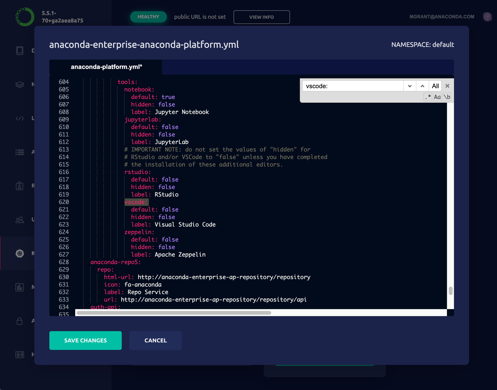

# Adding VSCode support to AE5

## Introduction

This repository allows AE5 customers to install VSCode and use it
within AE5. Technically, the stock Microsoft version of VSCode does
not run in a browser-based environment such as this, so instead we
rely upon [`code-server`](https://coder.com/docs/code-server/latest),
a patched version of VSCode that enables in-browser execution but
otherwise preserves VSCode behavior, including the use of extensions.

Auxiliary tools such as VSCode, RStudio, or Zeppelin are installed
into a shared volume provisioned just for this purpose. If VSCode
is the first tool being installed, those instructions will need
to be followed first. See the document [TOOLS.md](TOOLS.md) for
more details, and make sure that work is completed before
proceeding with the instructions here.

## Installation

We have broken up the installation process into four steps below:

1. _Set the tool volume to read-write._
2. _Pre-installation steps._
3. _Install VSCode._
4. _Post-installation steps._
5. _Enable the VSCode option._
6. _Further customize VSCode._
7. _Set the tool volume to read-only._

None of these steps affect existing sessions, deployments, and jobs.
However, once Step 1 is complete, any new sessions will have read-write
access to the `/tools` volume. This is deliberate, because we will
use a session to perform the installation. But this means any *other*
users will have read-write access, too. For this reason, we recommend
executing these steps during a maintenance interval, during which users
should not create new sessions.

### Step 1. Set the tool volume to read-write

1. Edit the `anaconda-platform.yml` ConfigMap. On Gravity clusters,
   this is most easily performed in the Ops Center.
2. Search for the `/tools:` volume specification.
3. Change `readOnly: true` to `readOnly: false`.
4. Save the changed configuration, and exit the editor.
5. Restart the workspace pod:
   ```
   kubectl get pods | grep ap-workspace | cut -d ' ' -f 1 | xargs kubectl delete pod
   ```
6. Monitor the new workspace pod using `kubectl get pods` and
   wait for it to stabilize.

### Step 2. Pre-installation steps
 
As mentioned above, installation will proceed from within a standard
AE5 session. So to begin the process, we complete the following steps:

1. Create a blank Python project using any "New Project" template.
   The Python version is not relevant.
2. (Recommended) Before launching a session, go to the new project's
   Settings tab and select the JupyterLab editor. Save that change.
3. Launch the session.
4. If you are doing a *Standard* or *Airgapped* installation (see below),
   contents of this installation repository into the project. The easiest
   way to do so is to use JupyterLab's upload functionality, and select
   all of the relevant files simultaneously. This step is optional for
   the *Archive* install method.
5. Launch a Terminal window to run the commands offered in each step below.
   
### Step 3. Install VSCode

There are three installation approaches that you can consider:

- _Standard install_. In this approach, the `code-server` package,
  the desired extensions, and support scripts are installed in a multi-step
  process. This provides the greatest ability to control and customize
  the installation.
- _Airgapped install_. For this approach, the `code-server` package
  and associated extensions are manually downloaded and delivered
  to the installation session. This is a valid option in cases where
  the cluster itself is not connected to the internet.
- _Archive install_. In this approach, the full contents of the `/tools/vscode`
  directory will be contained in an archive (tarball). This archive can
  be created, for instance, from a successful VSCode installation on
  another server. Anaconda periodically constructs just such an archive,
  containing a recent version of `code-server` and several common VSCode
  extensions. Feel free to ask support for a copy of this archive.
  
#### Standard install

1. If desired, examine the `manifest.yml` file. If you have already
   identified new versions of the listed files, or you wish to add or
   remove extensions, modify the file now. That said, you will be able
   to modify the installed extension set in a later step, so it is likely
   simpler to just proceed with the defaults at this time.
2. If necessary, set any temporary proxy settings you may need to access
   the external sites listed in the manfiest.
3. Run the installation script:
   ```
   bash install_vscode.sh
   ```

#### Airgapped install

1. Place the files `download.py` and `manifest.yml` onto a machine with
   a Python 3 interpreter and internet access.
2. Run the command
   ```
   python download.py --archive
   ```
   This will create a file called `downloads.tar.bz2`.
3. Move this archive into the airgapped environment.  
4. Upload the archive into the running AE5 session.
5. Run the installation script:
   ```
   bash install_vscode.sh
   ```
   
#### Archive install

1. Upload the archive into the project.
2. Make sure that the directory `/tools/vscode` exists, and is empty:
   ```
   mkdir -p /tools/vscode && rm -rf /tools/vscode/*
   ```
3. Unpack the archive into position:
   ```
   tar xfz -C /tools/vscode ae5-vscode.tar.gz
   ```
   substituting, if necessary, the correct name of the archive file.

### Step 4. Post-installation steps

1. Perform a simple verification of installation by running the script
   ```
   /tools/vscode/start_vscode.sh
   ```
   _This should exit with an error_, specifically an “Address already
   in use” error of some sort. The key is to verify that this error
   actually came from VSCode itself, which confirms that it is visible
   by Anaconda Enterprise.
2. Delete the archive, or the `downloads/` folder, from the project, if
   you wish to save space.
3. Shut down the session.
4. You can delete the work project if you wish, but it is reasonable to
   keep it to use in future installations.

### Step 5. Enable the VSCode option

The next step is to add VSCode to the editor selection list presented
by the UI.

1. Log into the ops center and pull up the platform ConfigMap for
   editing, just as you did in Step 2 when adding the new shared volume.
2. Search for the `vscode:` section of this file. The
   quickest way to do so is to focus the text editor and search for the
   text `vscode:` (including the colon). The default values
   in this section will look like this:
   ```
             vscode:
               default: false
               hidden: true
               label: Visual Studio Code
   ```
   Change the value `hidden: true` to `hidden: false`.
3. Once you have verified the correct formatting, click the "Save
   Changes" button.
4. Restart the UI pod. These pods should take less than a minute
   to refresh.
   ```
   kubectl get pods | grep 'ap-ui-\|ap-workspace-\' | \
       cut -d' ' -f1 | xargs kubectl delete pods
   ```

There may be minor disruptions in UI responsiveness during this time.
If you have allowed users to continue working during this time, they
may need to refresh their browsers, although this should
not be necessary for views of running sessions or deployments. Once
the UI pod stabilizes, in less than a minute, the VSCode editor
will be present in the Default Editor drop-down on the
project settings page.

To help clarify the desired result in this step, we have attached below
a screenshot of the Op Center for a typical cluster immediately after
Step 5 is completed.



### Step 6. Customize VSCode settings and extensions

At this stage, VSCode should be operational. Verify this by launching
a new session after selecting the Visual Studio Code option in that
project's settings. The editor should appear in the AE5 window, with
the file browser open to `/opt/continuum/project`. In the default
configuration, the Python module will immediately begin to initiailize.

If the installation is successful, you can now consider installing
additional extensions at this time. See the sections *Installing or
upgrading extensions* and *Modifying global settings* for more details.

Once you have completed this step, make sure to stop this
VSCode test session.

### Step 7. Set the tool volume to read-only

1. Edit the `anaconda-platform.yml` ConfigMap. On Gravity clusters,
   this is most easily performed in the Ops Center.
2. Search for the `/tools:` volume specification.
3. Change `readOnly: true` to `readOnly: false`.
4. Save the changed configuration, and exit the editor.
5. Restart the workspace pod:
   ```
   kubectl get pods | grep ap-workspace | cut -d ' ' -f 1 | xargs kubectl delete pod
   ```
6. Monitor the new workspace pod using `kubectl get pods` and
   wait for it to stabilize.

## Uninstalling

Removing VSCode is a relatively simple process.

1. If there are any existing sessions using VSCode, make sure they
   are stopped.
2. Search for the three-line `vscode:` section of this file, and change
   the line `hidden: false` to `hidden: true`.
3. Restart the UI pod:
   ```
   kubectl get pods | grep ap-ui- | \
   	   cut -d ' ' -f 1 | xargs kubectl delete pods
   ```

This removes VSCode as an editor option for new projects, but
existing projects will still be able to use the existing installation.
If you need to permanently remove `/tools/vscode`, take the following
additional steps:

4. Instruct users that they must modify all of their VSCode projects
   to use a different editor (e.g., JupyterLab) instead. If they fail
   to do so, sessions will fail to fully start.
5. Remove the `/tools/vscode` directory. If this can be performed
   outside of an AE5 session, this will likely be the most convenient
   approach. Otherwise, you must:
   - Execute Step 1 to set the volume to read-write;
   - Remove `/tools/vscode` from within an AE5 session;
   - Execute Step 7 to set the volume back to read-only.

Removing the `/tools` volume altogether is even more involved:

6. Shut down *all* sessions, deployments, and jobs, whether or not
   they are using the given editor. Unfortunately, removing the volume
   will disrupt the operation of all user pods that were created with
   the volume in place.
7. Edit the ConfigMap and remove the volume from the `volumes:` section.
8. Restart the workspace and deploy pods.
9. Restart any deployments and jobs at the AE5 level.   

## Managing and upgrading

Prior versions of the AE VSCode extension required building custom
Docker images. Because this is no longer necessary, upgrading and
managing the VSCode installation is much simpler.

### Upgrading to a new version of AE5

When upgrading AE5 itself, the VSCode installation will be unaffected.
However, the current upgrade logic will cause the VSCode option to be
re-hidden. To correct this, simply repeat Step 4 above to change
`hidden: true` back to `hidden: false`.

In future versions of AE5, it may be necessary to modify one or more of
the support scripts added during the installation process; e.g.,
`start_vscode.sh` itself. If this proves necessary, we will supply the
necessary instructions and replacement files, and the update will be
much simpler than a reinstall.

### Updating the VSCode installation

If you wish to upgrade VSCode itself, the best approach is to perform
a fresh installation. While `code-server` nominally supports in-place
upgrades, the savings for doing so are minimal, and a fresh installation
minimizes the risk of unexpected issues.

1. Ensure that all sessions using the VSCode editor are terminated.
2. Complete Steps 1 and 2 of the standard installation process. If you
   still have the AE5 project you used in the original installation,
   feel free to re-use that.
3. Before proceeding with Steps 3-4, move the existing VSCode installation
   aside; e.g.
   ```
   mv /tools/vscode /tools/vscode.old
   ```
   If the new installation fails for some reason, this can simply be
   moved back into place to avoid downtime.
4. Now complete Steps 3-4.
5. Launch a new session with the VSCode editor to verify installation.
6. Once satisfied, remove the old installation `/tools/vscode.old`.

### Installing or upgrading extensions

The `code-server` package offers nearly full compatiblity with all
standard VSCode extensions, most of which are open source and freely
available. However, Microsoft does not allow `code-server` or similar
repackaged versions of VSCode to download extensions directly from
its extension marketplace. For that reason, the
[Open VSX Registry](https://open-vsx.org)
has been created to offer an alternate source of these extensions.

Installing or upgrading extensions can be performed without a full
reinstallation of VSCode, but it still should be performed during a
maintenance interval:

1. If you are removing or upgrading existing extensions, instruct all
   VSCode users to terminate their sessions.
2. Run Step 1 above to make set the `/tools` volume to read-write.
3. Launch a session using the VSCode editor.
4. If you do not have a direct connection to the Open VSX Registry
   from your cluster, you will need to download the desired `*.visx`
   files manually, and upload them into the project.
5. Click the Extensions icon (four squares, with one offset) on the
   left-hand icon bar. You will be presented with a list of installed
   extensions. The three-dot menu contains a variety of options for
   searching the Open VSX marketplace.
6. To remove an extension, click the gear icon next to the extension
   and select "Uninstall".
7. To update the version of an extension, click the gear icon next to
   the extension and select "Install another version..."
8. To install an extension from disk, click the three-dot menu at the
   top-right corner of the extension pane and select "Install from VISX..."
9. If you have updated the Python extension, we recommend applying a
   minor patch to the extension itself to improve its performance
   when running inside of AE5. To do this, launch a terminal window and
   run the following command:
   ```
   python /tools/vscode/patch_python_ext.py
   ```
10. Once you are satisifed with the results, run Step 2 to
    return the `/tools` volume to read-only status.
   
*NOTE:* Do not select "Enable Auto Updating Extensions". This must remain a
manual, scheduled process.

### Modifying global settings

The file `/tools/vscode/admin_settings.json` contains settings that
Anaconda has determined are best enforced globally across all users
and all VSCode sessions. Whenever an AE5 sessions starts, these settings
are merged into the user's settings file `~/.vscode/User/settings.json`.
In this way, each user is able to customize their own experience, while
AE5 ensures that important settings are preserved.

You are free to modify this file (when, naturally, the `/tools` volume
is read-write) to add or modify these settings yourself. We recommend
the following workflow:

1. Start a VSCode session.
2. Modify the settings using the standard VSCode settings UI,
3. Once you are satisfied, examine the file `~/.vscode/User/settings.json`.
4. Create a new file `new_admin_settings.json` by copying the file
   `/tools/vscode/admin_settings.json`, and modify it by copying any
   desired settings from `~/.vscode/User/settings.json`.
5. With the `/tools` volume set to read-write access, copy this new
   file into place: `/tools/vscode/admin_settings.json`.
   
All VSCode sessions created from that point forward will adopt the
new settings.

### Creating an archived installation

The archive installation process is particularly useful if you have
built a customized VSCode installation that you would like to transfer
to another installation of AE5. Fortunately, the process of building
the archive is rather simple, and can be performed on an operating
cluster with no maintenance window:

1. Launch a terminal within any session.
2. Run the command:
   ```
   tar cfz ae5-vscode.tar.gz /tools/vscode .
   ```
3. Download the archive and deliver to its desired destination.
4. Delete the archive `ae5-vscode.tar.gz` from the project session.
